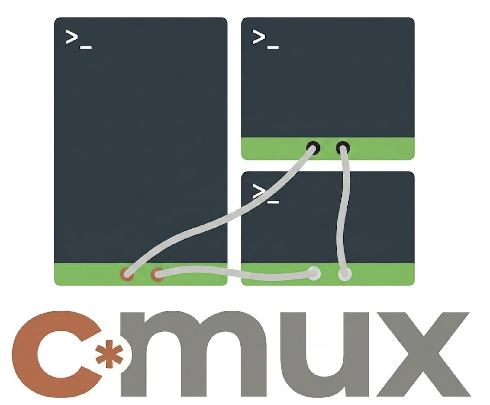

## A Claude Code multiplexer with agents that can message each other.

Cmux lets you spawn and manage multiple persistent Claude Code agents that can send and receive messages to each other.

## Install

Requires [Claude Code](https://claude.ai/code) to already be installed and authenticated on your machine.

```bash
curl -fsSL https://raw.githubusercontent.com/mekarpeles/cmux/main/install.sh | bash
```

The install script also handles tmux and pipx on macOS (Homebrew) and Ubuntu/Debian.

## How it works

Cmux is built on three primitives:

- **[claudio](https://github.com/mekarpeles/claudio)** — a lightweight IO wrapper that gives each Claude Code session an inbox. Each agent has a private message queue. Anything can write to it — another agent, a script, a human. When Claude is idle, the next message is delivered into the session.
- **[tmux](https://github.com/tmux/tmux)** — manages the sessions. Each agent runs in a named tmux window, persistent and re-attachable.
- **cmux** — the CLI that ties it together. Use it to start and manage claudio-wrapped Claude Code agents, and to send messages between them.

Running `cmux start <name>` launches a claudio-wrapped Claude Code session inside tmux, registers it by name, and starts listening for messages.

## Why cmux exists

Claude Code has two primary modes:
1. An interactive TUI for humans.
2. A JSON streaming mode for programmatic use.

Many long-lived CLI tools (tmux, emacs) solve this by running as servers that clients connect to. Cmux approximates this for Claude Code: a human can attach to a session via the TUI while other agents submit messages to its inbox. The result is a lightweight chat-room primitive — multiple agents and humans participating in the same session, however you'd like to wire them up.

Claude Code's experimental Agent Teams feature offers a related capability, but it is opinionated about orchestration and treats the multi-agent structure as a framework rather than a primitive. Cmux makes no assumptions about how agents relate to each other — it only gives each session an inbox and a name. You decide the topology. The goal is primitives and control.

## Tutorial

Let's create a `demo` team with Alice, Bob, and Carol. Bob will check if there are any new GitHub issues today for the Open Library project. Carol will check if there are any new unassigned PRs. Both will report to Alice, who gives us a summary of what's new.

**Step 1 — Start the coordinator**

First, spin up a new claudio agent named Alice and pass them an initial prompt. We use `-d` to start all of this work detached in the background. We use `-s` to add Alice to the tmux workspace session called `demo`.

```bash
# -s demo: add to shared workspace  -d: start detached  --: begins the initial prompt
cmux -s demo start alice -d -- "Hi Alice, you are today's project coordination for our cmux demo. Bob and Carol are cmux agents that will ping us shortly. Bob will check for new GitHub issues on internetarchive/openlibrary and Carol will check for new unassigned open PRs. Do not poll or run any commands — wait for cmux messages from Bob and Carol to arrive. Once you have both reports, present a short executive summary (a few bullet points each) directly in your window for the user to read."
```

**Step 2 — Start the researchers**

```bash
cmux -s demo start bob -d -- "You are Bob. Run: gh issue list --repo internetarchive/openlibrary --state open --json number,title,createdAt --limit 50. Filter to issues created today. Summarise count and titles, then report to Alice: cmux send alice '<your summary>'"

cmux -s demo start carol -d -- "You are Carol. Run: gh pr list --repo internetarchive/openlibrary --state open --json number,title,assignees --limit 50. Filter to PRs with no assignees. Summarise count and titles, then report to Alice: cmux send alice '<your summary>'"
```

**Step 3 — Check what is running**

```bash
cmux ls
```

```
AGENT                WORKSPACE        STARTED
------------------------------------------------------------
alice                demo          2026-06-15T10:00:00Z
bob                  demo          2026-06-15T10:00:03Z
carol                demo          2026-06-15T10:00:06Z
```

**Step 4 — Watch the summary arrive**

```bash
cmux attach alice   # Ctrl-b n / Ctrl-b p to switch windows
```

Bob and Carol each run their queries, send results to Alice's inbox, and Alice compiles the summary once both reports are in. Detach at any time with `Ctrl-b d`.

**Step 5 — Clean up**

```bash
cmux stop alice && cmux stop bob && cmux stop carol
```

---

## Usage

### Agents

**Start an agent** (starts and attaches):
```bash
cmux alice
```

**Start detached, with an initial prompt:**
```bash
cmux start alice -d -- "You are Alice, a project coordinator."
```

**List agents:**
```bash
cmux ls
```

**Attach / detach:**
```bash
cmux attach alice   # attach terminal
# Ctrl-b d          # detach (standard tmux keybinding)
```

**Stop an agent:**
```bash
cmux stop alice
```

### Messaging

```bash
cmux send alice "what is the status of the build?"
```

Messages are delivered as `[sender@cmux]: <message>` once Claude is idle. The sender is auto-detected when sending from inside a cmux session; pass `--from <name>` to set it explicitly:

```bash
cmux send alice "the tests are passing" --from bob
```

**Message length limits:** Messages over 2000 characters are rejected outright. Messages over ~400 characters may be detected by Claude Code's TUI as a paste event and shown as `[paste N lines]` rather than delivered as text — if this matters, write long content to a file and send a short pointer message instead.

### Workspaces

Group agents into one tmux session as windows/tabs:

```bash
cmux -s myproject start alice -d -- "You are Alice."
cmux -s myproject start bob -d   -- "You are Bob."

cmux attach alice        # opens myproject on Alice's window
# Ctrl-b n / Ctrl-b p   # move between agent windows

cmux stop bob            # kills Bob's window; workspace and Alice stay alive
```

`cmux ls` shows agents grouped by workspace:

```
AGENT                WORKSPACE        STARTED
------------------------------------------------------------
alice                myproject        2026-06-15T10:00:00Z
bob                  myproject        2026-06-15T10:00:01Z
carol                -                2026-06-15T10:00:02Z
```

**Restart all workspace agents** (e.g. after a reboot):

```bash
cmux -s myproject
```

This starts every agent registered to `myproject` that isn't already alive — no need to re-pass prompts or flags.

### Persistent agent registry

Agents are ephemeral by default — `cmux start alice` launches a fresh session with no memory between runs. To make an agent persistent (surviving stop/restart/reboot), register it first:

```bash
cmux agent register alice --role "Coordinator" --workspace demo -- "Initial prompt text"
```

After registration, `cmux start alice` auto-restores the workspace and initial prompt from the registry, with no flags needed. The registry lives in `~/.cmux/agents.db` and is never cleared by `cmux stop`.

This mirrors the Docker model: `cmux agent register` is like defining a container image; `cmux start` / `cmux stop` run and stop instances of it.

**List all registered agents (running + stopped):**

```bash
cmux agent list
```

**Remove an agent from the registry** (does not stop a running agent):

```bash
cmux agent rm alice
```

**Bootstrap the registry from currently running sessions:**

```bash
cmux agent import-sessions
```

### Session continuity

Each `cmux up` either starts a fresh Claude session (first time) or resumes via `--resume <uuid>`. The session UUID is detected after startup and stored in `~/.cmux/{name}/last-session-id`.

**First start** — `identity.md` scaffolded from initial prompt, orientation injected:

```bash
cmux up alice -d -- "You are Alice, the auth specialist."
# Writes ~/.cmux/alice/identity.md, sends orientation, starts fresh Claude.
```

**Subsequent starts** — session resumes via `claude --resume <uuid>`, orientation re-injected:

```bash
cmux up alice -d
# Resumes Alice's exact last conversation. Previous context is in session history.
```

**Agent home dir** — `~/.cmux/{name}/` persists across restarts. Agents use it for:
- `identity.md` — role/persona context, auto-injected on first start
- `.cq/` — personal issue queue (`cq issue list` auto-resolves here)
- `notes/` — any persistent scratchpad files

**Task tracking** — use `cq`, the per-agent issue tracker:

```bash
cq issue create -t "Review open PRs"        # creates issue in ~/.cmux/alice/.cq/
cq issue list                               # shows open issues for current agent
```

cq is auto-resolved to the agent's home dir when `CMUX_SESSION_NAME` is set (which cmux always sets).

### Health check

Agents can silently block on Claude Code permission prompts for hours. `cmux check` inspects every running agent non-destructively:

```bash
cmux check
```

```
Checking 3 running agent(s)...
  [OK]    alice
  [STUCK] bob             — permission prompt detected (demo:bob)
  [OK]    carol

1 agent(s) blocked at permission prompt:
  tmux attach -t demo:bob
```

Attach to the reported target and approve or deny to unblock.

### Auto-unblock mode

If you trust an agent to dismiss permission prompts automatically, start it with `--unblock`:

```bash
cmux start alice -d --unblock
# or register it persistently:
cmux agent register alice --unblock
```

With `--unblock`, a background thread polls the agent's pane every 1–2 seconds. When a permission/security prompt is detected, it sends `Escape` to dismiss it and then injects:

```
[claudio@noreply]: A security/permission prompt was detected and automatically dismissed.
Something in our workflow triggered a blocking security response — continuing with normal operation.
```

This lets fully autonomous agents keep running without human approval. Use with care — `--unblock` bypasses every security confirmation Claude Code would normally show you.

The flag is stored in `agents.db`, so it is restored on every `cmux start` after registration. Toggle it off by re-registering without the flag:

```bash
cmux agent register alice   # clears --unblock
```

---

More examples in [`examples/`](examples/).
